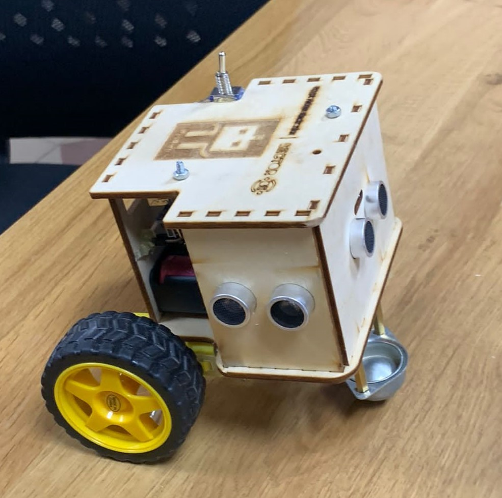

# Maze-Solver Robot: pi-bot

## Overview

An automated maze solver robot based on Arduino Uno and a motor driver shield, equipped with three ultrasonic sensors, is designed to navigate and solve mazes autonomously. Let's break down the components and functionality of this robot:

## Components

1. Arduino Uno:
   It serves as the brain of the robot, controlling all the operations and interactions with the sensors and motor driver.

2. Motor Driver Shield:
   This shield interfaces with the Arduino and controls the motors that drive the robot's movement.

3. Ultrasonic Sensors:
   Three ultrasonic sensors are placed at the front, left, and right sides of the robot. They provide distance measurement and obstacle detection capabilities.

4. Motors:
   The robot uses 2 DC motors, I used geared ones, connected to the motor driver shield to drive its wheels for movement.

5. Lithium Ion batteries:
   The robot is powered by 3 litthim ion batteries that supplies around 11.2 volts and 2000 mAH.

6. Switch:
   To start and stop the robot

## Functionality

#### Initialization:

The robot initializes by setting up the Arduino, configuring pins, and initializing the motor driver shield and ultrasonic sensors.

    Note: Pins used are defined at "/include/define.h"

#### Movement:

The robot moves by controlling the motors through the motor driver shield. It can move forward, backward, turn left, and turn right based on the maze-solving algorithm.
The value of PWM is selected according to the battery voltage level. Thus, the robot's speed is kept between specific values. It was planned to use a voltage sensor the detect the battery level automatically, but this is not implemented yet, thus we use an AVO-meter to find the value of the batteries

#### Maze Solving Algorithm:

The Wall Follower algorithm is a popular maze-solving algorithm used by autonomous robots to navigate through mazes. It is a simple and efficient method that allows the robot to follow the walls of the maze until it reaches the exit. Let's break down the key characteristics of the Wall Follower algorithm:

- Start: The robot starts at an entry point of the maze and chooses a wall to follow (This is set in the "main.c"). Typically, the robot chooses either the left or right wall as a reference.

- Wall Following: The robot starts moving forward while keeping the chosen wall on its side using the ultrasonic. It maintains a constant distance from the wall using sensors or other proximity detection mechanisms.

- Junction Handling: Whenever the robot reaches a junction or intersection, it follows a set of predefined rules to determine its next move. The common rule is to prioritize the wall on the same side as the initial choice (left or right). For example, if the robot is following the left wall, it will always turn left at junctions.

- Dead-End Detection: When the robot encounters a dead-end, which is a path with no available openings, it turns around and backtracks to the last junction. This allows the robot to explore other paths and avoid getting stuck in loops.

- Goal Reached: The robot continues following the wall until it reaches the exit or the designated goal point of the maze. The algorithm ensures that the robot systematically explores the entire maze while maintaining a connection with the wall.

The Wall Follower algorithm guarantees that the robot will eventually find the exit in a simply-connected maze with no loops. However, in complex mazes with loops or disconnected paths, the robot may not find a solution. In such cases, additional algorithms or modifications are required.

### Support Me

